# Kitchen Chaos Recreation

A Unity recreation project developed while following the Kitchen Chaos tutorial.

## Milestone 1

**Tutorial progress:** Episode 13, approximately 2.5 hours  
**Completion date:** 13 September 2026

### Work Completed

- Configured Unity's New Input System with a Player Action Map and a 2D Vector Composite for WASD movement.
- Implemented normalized player movement and smooth rotation using `Vector3.Slerp`.
- Connected the player's walking state to separate idle and walking animations.
- Added a Collider and Rigidbody constraints to prevent the player from tipping over.
- Moved Rigidbody calculations into `FixedUpdate` to follow fixed physics timing.

### Evidence

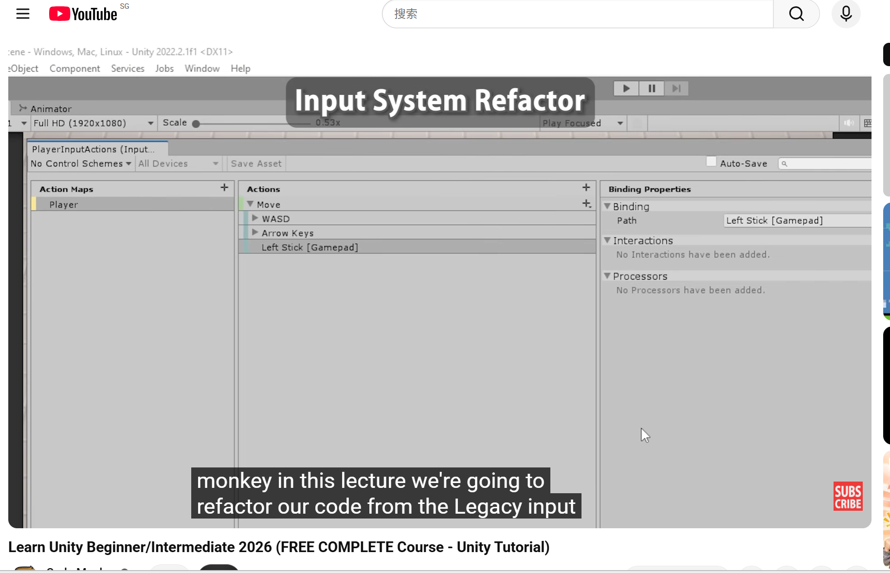

- [Game View recording](https://youtu.be/tsoGaSb0wOM)
- [GitHub commit](https://github.com/ppxjing/KitchenChaos2026/commit/0a91cb86240767284a61b725003c0485061a11eb)

### What I Learned

`Vector3.Slerp` creates smooth player rotation, while a zero-vector check keeps the player's last facing direction when movement stops. Private fields protect data from direct access by other classes, and `[SerializeField]` allows those fields to remain editable in the Unity Inspector.

Separating player movement from visual animation prevents both systems from changing the same position and interfering with each other. Unity's New Input System also separates control bindings from gameplay logic. A 2D Vector Composite combines four directional keys into one movement value, while Action Maps organize related controls. `FixedUpdate` follows the fixed timing used by Rigidbody physics calculations, keeping movement and physics calculations on the same update cycle.

## Milestone 2

**Tutorial progress:** Lessons 14–51  
**Completion date:** 19 September 2026
**Gameplay video:** [Watch on YouTube](https://youtu.be/KzAi7k8tuk8)

### Work Completed

- Added counter selection through raycasts and visual highlighting.
- Implemented E-key interaction to pick up, place, and transfer kitchen objects.
- Added container counters that spawn ingredients when the player has empty hands.
- Created clear counters, cutting counters, stoves, plates, and food transfer between holders.
- Added ingredient preparation, including cutting and cooking states.
- Added plates that can hold valid ingredients and display their ingredient list.
- Used shared counter logic through base classes and prefab variants.

### Controls

| Key | Action |
| --- | --- |
| `WASD` or Arrow Keys | Move |
| `E` | Start the game and interact with the selected counter |
| `F` | Alternate interaction, such as cutting or operating a stove |
| `Esc` | Pause or resume |

Move close to a counter and face it. The counter is highlighted when selected. After pressing `E` to start, wait for the short countdown before interacting. Container counters only give an ingredient when the player is not already holding one.

### Evidence

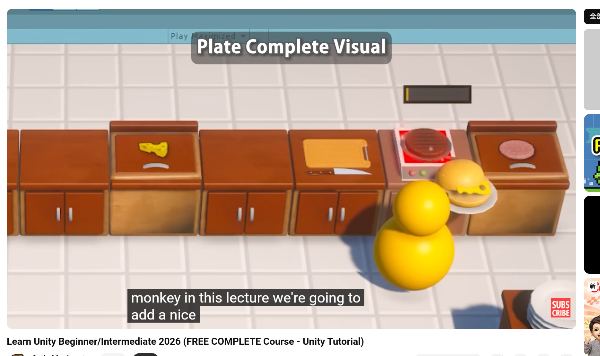

### What I Learned

BaseCounter stores the colliders, scripts, and settings shared by counters. Prefab Variants inherit those common parts while keeping their own visuals and functionality.

GameInput detects key presses and sends interaction events. Player subscribes to those events and performs the interaction, so controls and player behavior remain separate.

CounterTopPoint marks where a kitchen object should be placed. After an object becomes its child, local position zero aligns it with that point. Without the correct parent, zero refers to the world origin.

KitchenObjectHolder manages shared kitchen-object placement and transfer behavior. Specific counters inherit that shared behavior and implement their own interaction rules, reducing duplicated code.

ContainerCounter can act as a parent for visual child objects. Moving, rotating, or scaling the parent also changes its children, which keeps related counter objects organized.

## Milestone 3

**Tutorial progress:** Lessons 52–75  
**Completion date:** 23 September 2026
**Gameplay video:** [Watch on YouTube](https://youtu.be/fGUQYDOfGK8)

### Work Completed

- Added a Main Menu with Play and Quit buttons, plus a loading-scene transition into the kitchen.
- Added a game-state flow: waiting to start, countdown, active gameplay, and game over.
- Added automatic recipe orders, with up to four waiting recipes at one time.
- Built the recipe-list UI from reusable templates so each order displays its name and ingredient icons.
- Added a Delivery Counter that checks a plate against the waiting recipes.
- Added success and failure events when food is delivered.
- Connected background music and gameplay sound effects to the game managers and interaction events.

### How to Play

Run the project and select **PLAY** from the Main Menu. Press `E` once in the kitchen to start the three-second countdown. After the game begins, orders appear in the upper-left corner. Prepare the listed ingredients on a plate, face the Delivery Counter, and press `E` to submit the plate.

### Evidence

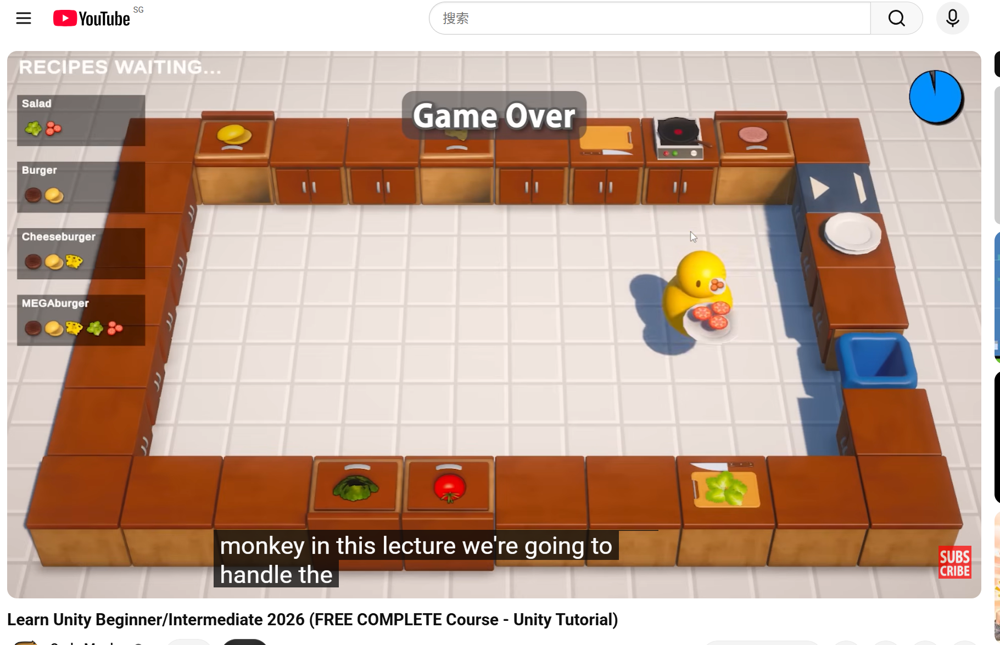

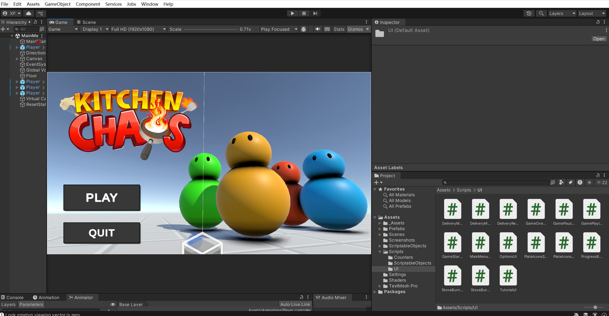

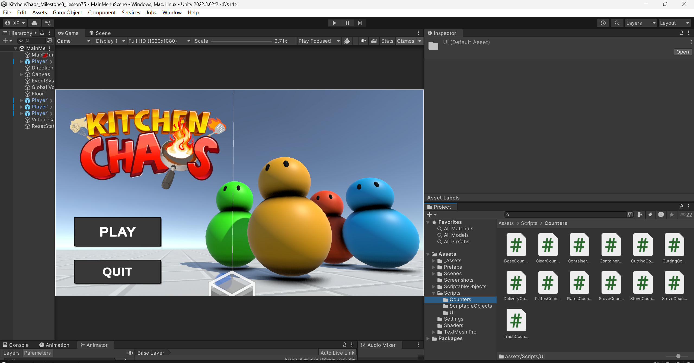

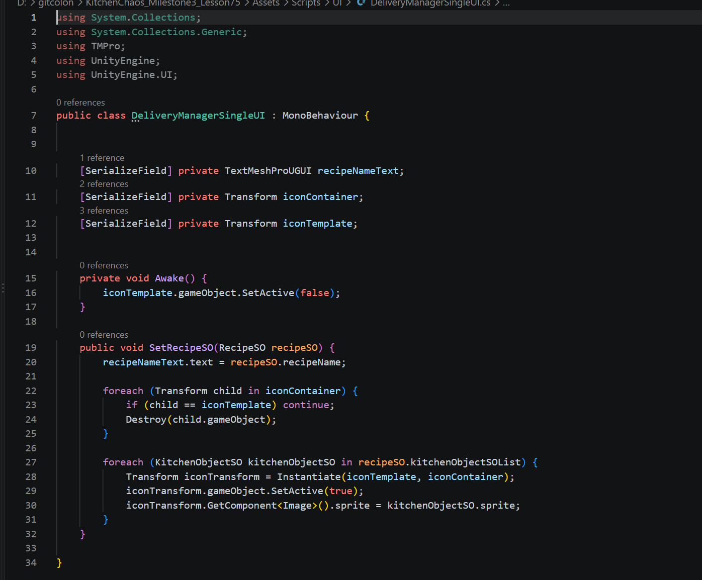

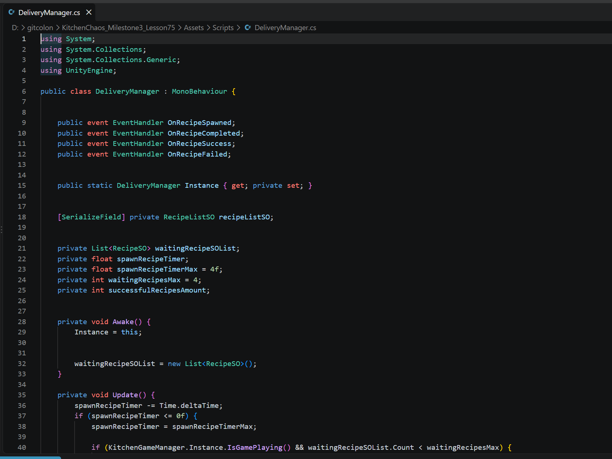

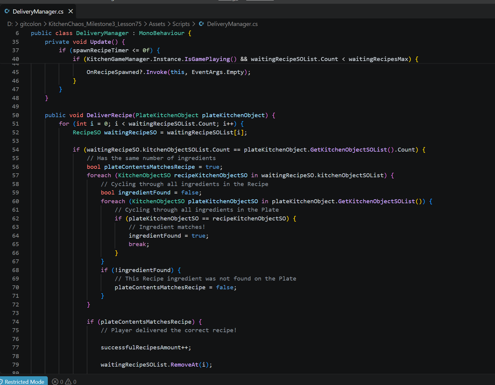

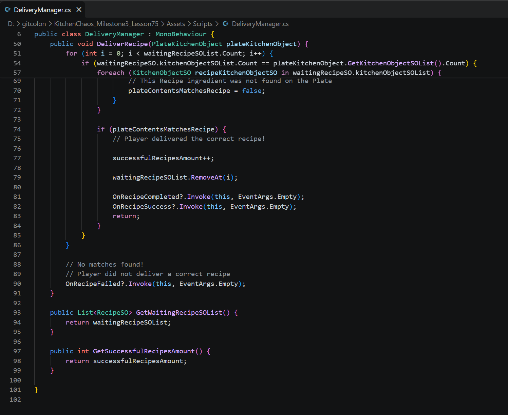

### What I Learned

Recipe data is stored in ScriptableObjects. The DeliveryManager chooses a recipe from the recipe list, stores it in a waiting list, and tells the UI to refresh through an event.

The recipe UI uses a hidden template. It creates a copy for each order, then creates ingredient-icon copies inside that order. This lets one UI design display recipes with different ingredient counts.

The DeliveryCounter passes the player's plate to the DeliveryManager. The manager compares the ingredients on the plate with each waiting recipe. A matching plate removes the order and sends success events; an incorrect plate sends a failure event.

Game states control when systems are allowed to run. The player presses `E` to begin the countdown, the playing state starts order generation and the timer, and the game-over state shows the final score.

## Milestone 4

**Tutorial progress:** Lessons 76–106  
**Completion date:** 27 September 2026
**Gameplay video:** [Watch on YouTube](https://youtu.be/BSshn0vOY4w)

### Work Completed

- Added a tutorial overlay that explains keyboard and gamepad controls before the round begins.
- Added pause, resume, return-to-main-menu, and settings screens.
- Added music and sound-effect volume controls that save the chosen value.
- Added keyboard and gamepad key rebinding, including an on-screen prompt while selecting a new key.
- Updated the tutorial and settings screens after a control binding changes.
- Added a reset manager so static counter events reset correctly when a scene loads.
- Added player footstep sound playback while the player walks.
- Added the countdown, game clock, stove warning feedback, delivery feedback, and final game-over result screen.
- Fixed the countdown display so it renders `3`, `2`, and `1` correctly.

### How to Test

1. Run the project and choose **PLAY**.
2. Read the tutorial overlay, then press `E` to start the countdown.
3. Press `Esc` to open the pause screen. Test **Resume**, **Options**, and **Main Menu**.
4. In **Options**, click the music or sound-effect rows to change volume. Click a key row, then press a new key to rebind it.
5. Start a round and check the timer, orders, delivery success or failure feedback, and the game-over score.
6. Leave food on the stove long enough to view the cooking and burning warning feedback.

### Evidence

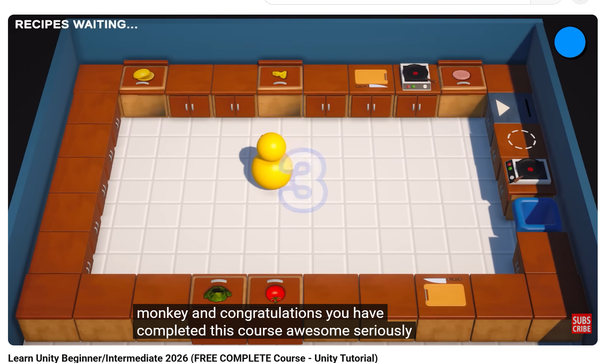

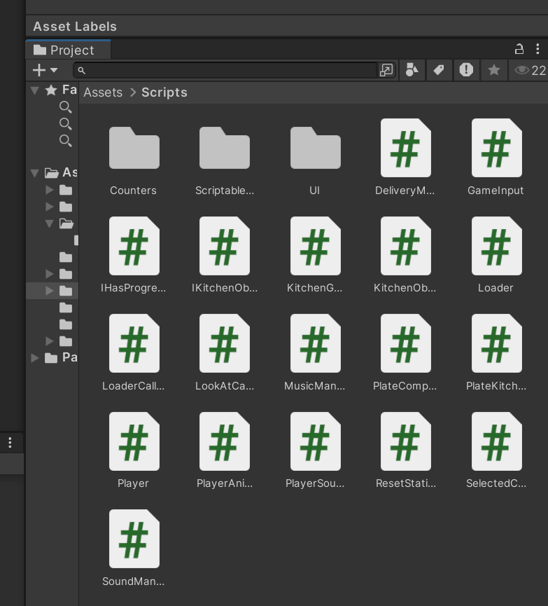

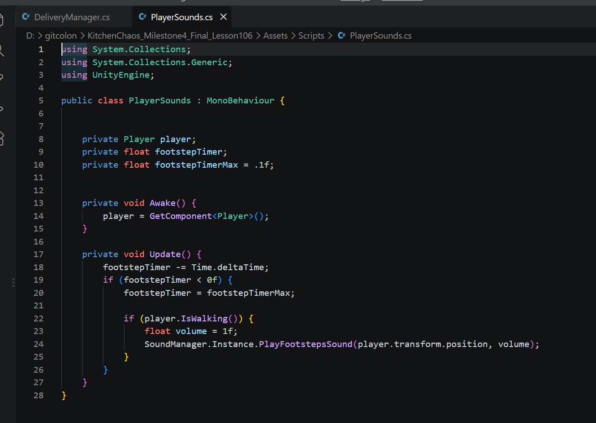

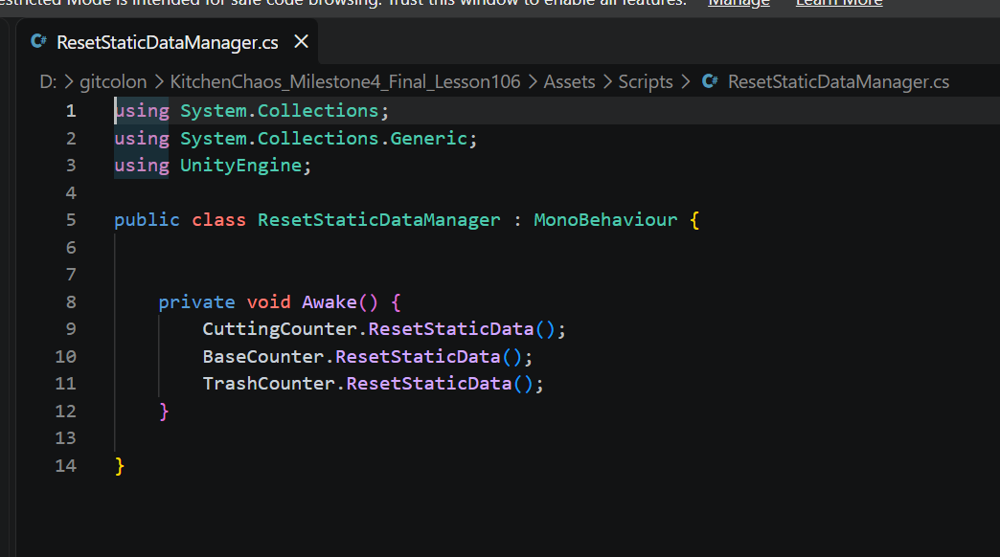

### What I Learned

A pause menu changes `Time.timeScale` to stop game time. The menu can then show Resume, Options, and Main Menu actions without stopping the Unity application itself.

PlayerPrefs saves simple values such as music volume, sound-effect volume, and custom key bindings. The values are loaded again when the project starts.

Key rebinding updates the input action instead of changing gameplay code. UI text reads the current binding from GameInput, so the tutorial and settings menu can display the new key automatically.

Static events can keep old listeners after a scene change. ResetStaticDataManager clears those static event lists when a scene loads, preventing duplicate reactions in the next game.

PlayerSounds checks whether the player is walking and uses a short timer to play footsteps at intervals instead of every frame.

## Final Game

Play the WebGL game on Itch.io:

[KitchenChaos2026](https://ppxjsnd.itch.io/kitchenchaos2026)

