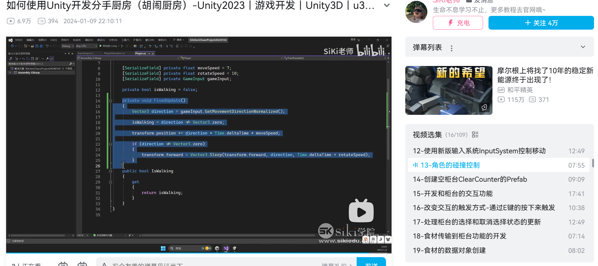
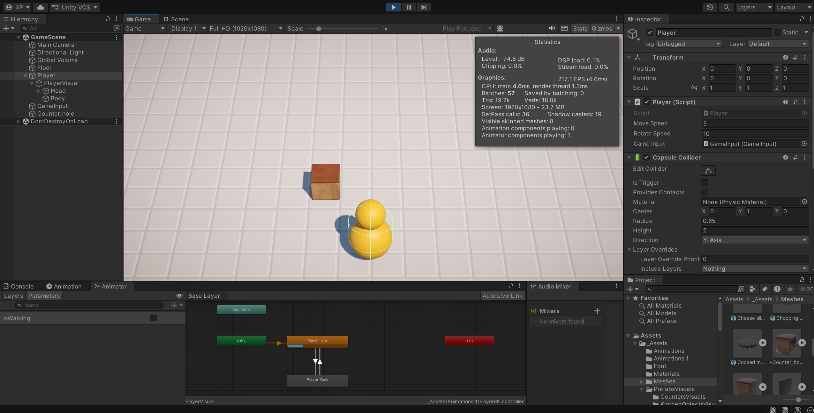
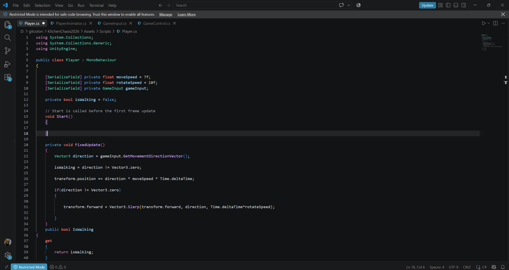
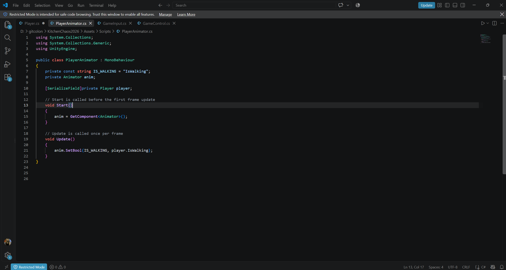
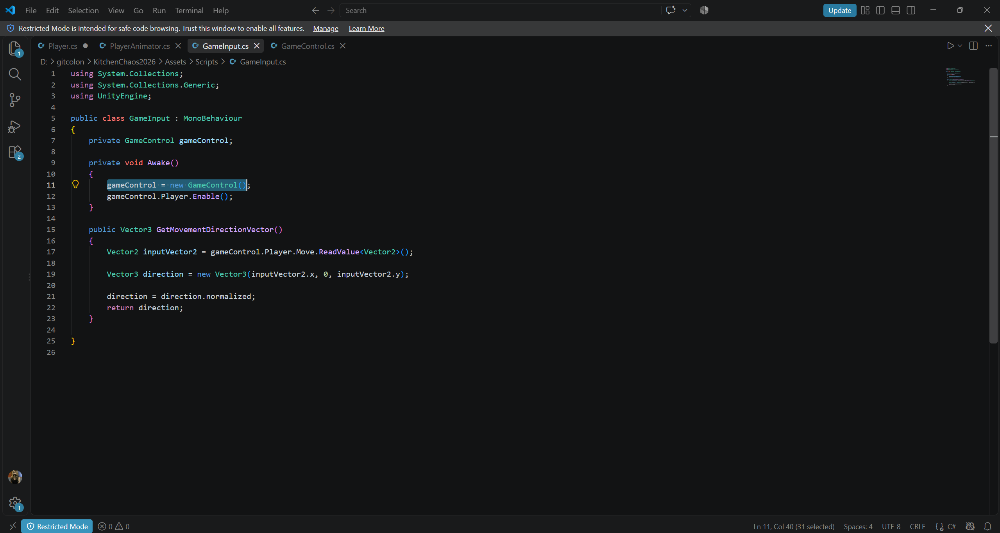
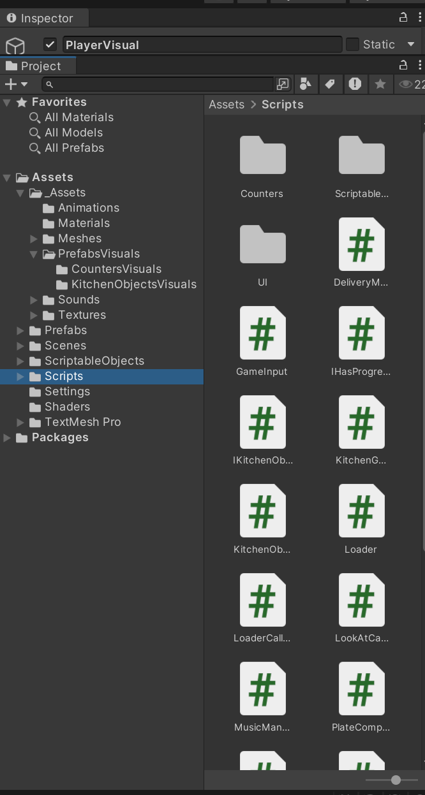
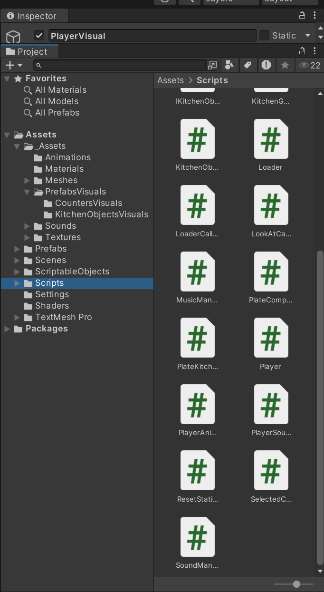
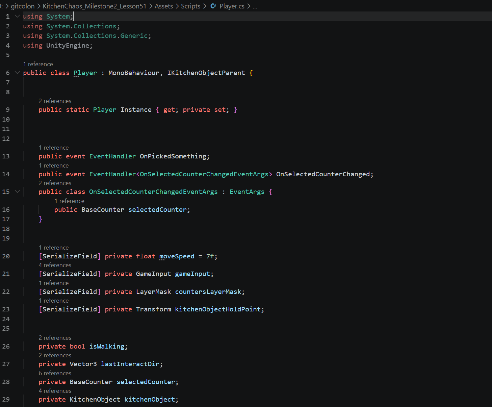
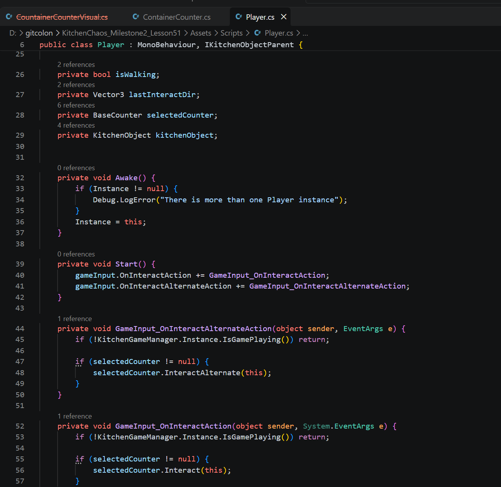
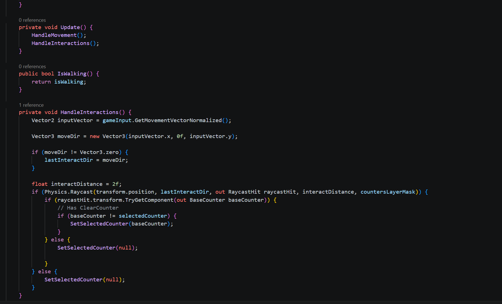

# Kitchen Chaos Recreation

A Unity recreation project developed while following the Kitchen Chaos tutorial.

## Milestone 1

**Tutorial progress:** Episode 13, approximately 2.5 hours  
**Completion date:** 27 September 2026

### Work Completed

- Configured Unity's New Input System with a Player Action Map and a 2D Vector Composite for WASD movement.
- Implemented normalized player movement and smooth rotation using `Vector3.Slerp`.
- Connected the player's walking state to separate idle and walking animations.
- Added a Collider and Rigidbody constraints to prevent the player from tipping over.
- Moved Rigidbody calculations into `FixedUpdate` to follow fixed physics timing.

### Evidence

- [Game View recording](https://youtu.be/tsoGaSb0wOM)
- [GitHub commit](https://github.com/ppxjing/KitchenChaos2026/commit/0a91cb86240767284a61b725003c0485061a11eb)

### What I Learned

`Vector3.Slerp` creates smooth player rotation, while a zero-vector check keeps the player's last facing direction when movement stops. Private fields protect data from direct access by other classes, and `[SerializeField]` allows those fields to remain editable in the Unity Inspector.

Separating player movement from visual animation prevents both systems from changing the same position and interfering with each other. Unity's New Input System also separates control bindings from gameplay logic. A 2D Vector Composite combines four directional keys into one movement value, while Action Maps organize related controls. `FixedUpdate` follows the fixed timing used by Rigidbody physics calculations, keeping movement and physics calculations on the same update cycle.

## Milestone 2

**Tutorial progress:** Lessons 14–51  
**Gameplay video:** [Watch on YouTube](https://youtu.be/KzAi7k8tuk8)

### Work Completed

- Added counter selection through raycasts and visual highlighting.
- Implemented E-key interaction to pick up, place, and transfer kitchen objects.
- Added container counters that spawn ingredients when the player has empty hands.
- Created clear counters, cutting counters, stoves, plates, and food transfer between holders.
- Added ingredient preparation, including cutting and cooking states.
- Added plates that can hold valid ingredients and display their ingredient list.
- Used shared counter logic through base classes and prefab variants.

### Controls

| Key | Action |
| --- | --- |
| `WASD` or Arrow Keys | Move |
| `E` | Start the game and interact with the selected counter |
| `F` | Alternate interaction, such as cutting or operating a stove |
| `Esc` | Pause or resume |

Move close to a counter and face it. The counter is highlighted when selected. After pressing `E` to start, wait for the short countdown before interacting. Container counters only give an ingredient when the player is not already holding one.

### Evidence

### What I Learned

BaseCounter stores the colliders, scripts, and settings shared by counters. Prefab Variants inherit those common parts while keeping their own visuals and functionality.

GameInput detects key presses and sends interaction events. Player subscribes to those events and performs the interaction, so controls and player behavior remain separate.

CounterTopPoint marks where a kitchen object should be placed. After an object becomes its child, local position zero aligns it with that point. Without the correct parent, zero refers to the world origin.

KitchenObjectHolder manages shared kitchen-object placement and transfer behavior. Specific counters inherit that shared behavior and implement their own interaction rules, reducing duplicated code.

ContainerCounter can act as a parent for visual child objects. Moving, rotating, or scaling the parent also changes its children, which keeps related counter objects organized.
